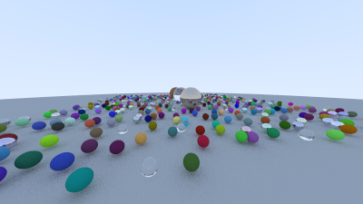
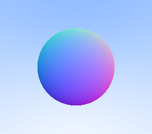
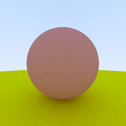
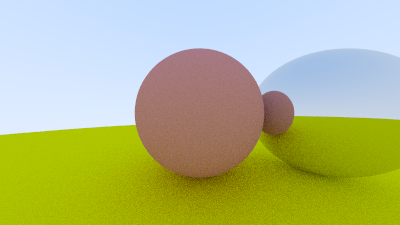
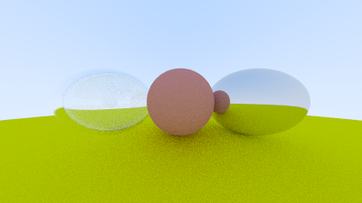
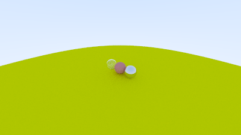

# C++ Ray Tracing Renderer



A ray tracing renderer implemented in **C++**. 
This project covers the core pipeline of a basic path tracer, including ray generation, ray-object intersection, material scattering, recursive color accumulation, depth of field, BVH acceleration, and multithreaded rendering.

---

# 项目概述（Project Overview）

本项目基于 C++ 实现了一个 **Ray Tracing 渲染器**，完整实现了从光线生成（ray generation）、几何求交（ray-object intersection）、材质散射（material scattering）到递归颜色累积（recursive path tracing）的渲染流程。

整体流程如下：

```text
Camera
   ↓
Generate primary rays
   ↓
Ray-object intersection
   ↓
Hit record (point, normal, material)
   ↓
Material scattering
   ↓
Recursive ray tracing
   ↓
Color accumulation
   ↓
Image output
```

项目支持多种材质模型、景深相机（depth of field）、BVH 空间加速结构以及多线程渲染优化。

---

# Render Gallery

### Sphere Intersection



### Diffuse Material



### Metal Material



### Glass Material

![04_glass]./image/04_glass.png)

### Camera System



### Depth of Field



### Random Scene


------

# 功能实现（Implemented Features）

## Ray–Sphere Intersection（光线与球体求交）

实现了 Ray Tracing 中最基础的几何计算：光线与球体求交。

流程：

```
Generate ray
    ↓
Intersect with sphere
    ↓
Compute nearest valid hit
    ↓
Record hit point and normal
```

关键点：

- 将光线方程代入球面方程，求解二次方程
- 选择 `[t_min, t_max]` 范围内最近的合法交点
- 使用 `hit_record` 记录交点、法线和材质信息
- 使用 `front_face` 修正法线方向，保证后续反射/折射计算一致性

------

## 材质系统（Material System）

设计统一的 `material` 抽象接口，通过 `scatter(...)` 描述光线命中表面后的传播行为。

当前实现三种材质：

- **Lambertian**（漫反射）
- **Metal**（金属反射）
- **Dielectric**（折射材质 / 玻璃）

统一接口负责输出：

- 是否继续散射
- 散射光线方向
- 颜色衰减（attenuation）

该设计将 **几何求交（geometry）** 与 **光照传播（light transport）** 解耦，方便扩展。

------

## 漫反射（Lambertian）

基于随机采样（Monte Carlo Sampling）模拟粗糙表面的漫反射。

流程：

```
Ray hits surface
    ↓
Generate random scatter direction
    ↓
Trace scattered ray recursively
    ↓
Multiply by albedo
```

关键点：

- 使用法线 + 随机单位向量生成散射方向
- 在半球范围内近似光的扩散
- 使用 albedo 作为颜色衰减
- 处理 near-zero 向量避免数值问题

------

## 金属材质（Metal）

实现基于镜面反射（specular reflection）的材质。

流程：

```
Incoming ray
    ↓
Compute reflection direction
    ↓
Generate reflected ray
    ↓
Trace recursively
```

关键点：

- 使用反射公式计算镜面反射方向
- 保持较强方向性（相比漫反射）
- 使用 albedo 控制颜色衰减
- 过滤向内反射的无效光线

> 当前实现以理想镜面反射为主，`fuzz` 参数用于后续扩展粗糙金属模型

------

## 玻璃材质（Dielectric）

实现支持反射与折射的透明材质。

流程：

```
Incoming ray
    ↓
Check refraction condition
    ↓
Choose reflection or refraction
    ↓
Trace recursively
```

关键点：

- 基于 Snell 定律计算折射方向
- 支持全反射（Total Internal Reflection）
- 使用 Schlick approximation 估计反射概率
- 根据 front_face 判断折射率方向（空气→介质 / 介质→空气）

------

## 相机系统（Camera System）

实现可配置相机，支持：

- 相机位置（lookfrom）
- 观察目标（lookat）
- 视场角（FOV）
- 宽高比（aspect ratio）

流程：

```
Camera parameters
    ↓
Build viewport
    ↓
Generate primary rays
```

关键点：

- 构建相机局部坐标系（u, v, w）
- 根据 FOV 计算视口大小
- 根据像素位置生成主光线

------

## 景深（Depth of Field）

基于薄透镜模型（thin lens model）实现景深效果。

流程：

```
Sample point on lens
    ↓
Offset ray origin
    ↓
Project toward focus plane
    ↓
Trace ray
```

关键点：

- 在单位圆盘中随机采样模拟镜头口径
- 使用 aperture 控制虚化强度
- 使用 focus distance 控制对焦位置
- 实现近实远虚效果

------

## 递归光线追踪（Recursive Ray Tracing）

通过递归实现多次反弹的光传播。

流程：

```
Cast ray
   ↓
Hit object?
   ├─ No → return background color
   └─ Yes
        ↓
   Material scatter
        ↓
   Trace next ray
        ↓
   Multiply by attenuation
```

关键点：

- 使用递归深度限制防止无限循环
- 未命中时返回渐变背景（sky gradient）
- 累积多次散射后的颜色贡献

------

# 性能优化（Performance Optimization）

## 渲染性能

| Stage                  | Render Time  |
| ---------------------- | ------------ |
| Initial implementation | ~6.5 minutes |
| After BVH acceleration | ~60 seconds  |
| After multithreading   | ~10 seconds  |

------

## BVH 加速（Bounding Volume Hierarchy）

使用 BVH + AABB（Axis-Aligned Bounding Box）减少无效求交。

流程：

```
Ray
 ↓
Test BVH node bounding box
 ↓
Hit box?
 ├─ No → skip subtree
 └─ Yes → test child nodes
```

关键点：

- 每个节点维护一个包围盒（AABB）
- 按随机轴对物体排序并递归构建树结构
- 先测盒子，再测子节点
- 大幅减少 ray-object intersection 次数

------

## 多线程渲染（Multithreaded Rendering）

基于 `std::thread` 实现并行渲染。

流程：

```
Split image rows
    ↓
Assign to threads
    ↓
Render in parallel
    ↓
Merge result
```

关键点：

- 按图像行划分任务
- 每个线程独立计算像素
- 利用像素计算天然可并行的特点
- 显著降低渲染时间

------

# 项目结构（Project Structure）

```
project
│
├── main.cpp
├── vec3.h
├── ray.h
├── camera.h
│
├── hittable.h
├── hittable_list.h
├── sphere.h
│
├── material.h
├── lambertian.h
├── metal.h
├── dielectric.h
│
├── aabb.h
├── bvh.h
│
├── stb_image_write.h
│
├── output/
└── images/
```

------

# Future Work

Planned improvements:

- Rough metal reflection（基于 fuzz 的粗糙反射）
- HDR environment lighting
- Triangle / mesh support
- Texture mapping
- Importance sampling
- Advanced path tracing optimization

------

# References

- *Ray Tracing in One Weekend* series