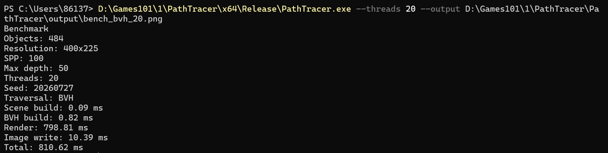

# C++ Ray Tracing 渲染器

基于 C++ 实现的 CPU 光线追踪渲染器。项目完成了从相机生成光线、场景求交、材质散射、递归追踪到图像输出的基础渲染流程，并在此基础上补充了 BVH + AABB 加速结构、多线程渲染和分段 benchmark 记录。

当前默认场景为随机球体场景，包含地面球、三颗主球和一批随机小球。渲染器支持 Lambertian 漫反射、Metal 镜面反射、Dielectric 折射材质，以及基于薄透镜模型的 Depth of Field 景深相机。

## 技术栈

- C++17
- Monte Carlo Sampling
- Bounding Volume Hierarchy / Axis-Aligned Bounding Box
- Multithreading / `std::thread`
- `stb_image_write`

## 项目演示


## 核心设计亮点

1. 基于 Hit Record 组织求交结果，记录命中点、法线、命中距离和材质指针，并交由材质系统决定后续散射光线。
2. 实现 Lambertian、Metal、Dielectric 三类材质，分别覆盖漫反射、镜面反射、折射、全反射和 Schlick 近似反射概率。
3. 构建 BVH + AABB 加速结构，射线先测试节点包围盒，再递归进入子树，减少随机球体场景中的无效求交。
4. 使用 `std::thread` 按图像行区间并行渲染，并补充固定参数 benchmark，分别记录场景构建、BVH 构建、渲染和图片输出耗时。

## 1. 材质系统与景深相机

### 设计目标

几何体求交和材质响应分开处理。球体求交只负责判断光线是否命中，并写入 `hit_record`；材质通过统一的 `scatter(...)` 接口决定是否继续传播、散射方向和颜色衰减。

当前材质实现如下：

| 材质 | 实现内容 | 当前用途 |
| --- | --- | --- |
| Lambertian | 法线方向叠加随机单位向量生成散射方向 | 表现粗糙表面的漫反射 |
| Metal | 根据入射方向和法线计算镜面反射方向 | 表现金属球的方向性反射 |
| Dielectric | 根据折射率、全反射条件和 Schlick 近似选择反射或折射 | 表现玻璃球的透明折射效果 |

### 递归追踪流程

```text
Camera ray
    -> scene hit
    -> fill hit_record
    -> material scatter
    -> trace scattered ray
    -> accumulate attenuation
```

当前默认参数中，`samples_per_pixel` 为 100，`max_depth` 为 50。递归深度耗尽时返回黑色，光线未命中场景时返回天空渐变背景。

### Depth of Field

景深相机使用薄透镜模型。生成光线时，先在镜头圆盘内随机采样，将 ray origin 从相机原点偏移到镜头采样点，再让光线指向焦平面位置。`aperture` 控制镜头采样半径，`focus_dist` 控制对焦距离。


## 2. BVH 加速结构与 AABB 求交

### 设计目标

随机球体场景中包含数百个可求交物体。线性遍历会让每条光线直接检查场景列表中的全部物体，采样数和递归深度提高后，求交部分会成为主要耗时来源。

项目使用 BVH 将物体组织成二叉树，每个节点保存左右子树合并后的 AABB。射线遍历时先测试节点包围盒，未命中时直接跳过该节点下的所有物体。

### 构建流程

```text
Object list
    -> choose split axis
    -> sort by AABB minimum
    -> split at median
    -> build left / right child
    -> merge child boxes
```

当前 BVH 构建时会选择一个空间轴，对当前范围内的物体按 AABB 最小点排序，然后使用中位数切分左右子树。叶节点保存一个或两个物体，内部节点保存左右子树的合并包围盒。

### 遍历流程

```text
Ray
    -> test node AABB
    -> miss: skip subtree
    -> hit: test left child
    -> use closest t to test right child
    -> return closest hit
```

左子树命中后，遍历右子树时会使用当前最近命中的 `t` 值收缩 `t_max`。这样右子树中更远的交点会被过滤，最终返回当前射线范围内最近的有效命中。

### AABB Slab Test

AABB 求交使用三轴区间裁剪。对 x、y、z 三个轴分别计算光线进入和离开包围盒平面的参数范围，并持续收缩全局 `[t_min, t_max]`。任一轴上的区间为空时，说明光线不会穿过当前包围盒。

## 3. 多线程渲染与 Benchmark

### 设计目标

像素采样之间互不依赖，渲染阶段可以按图像区域并行。项目使用 `std::thread` 将图像按行区间划分给多个线程，每个线程只写入 framebuffer 中自己的连续区域，避免多个线程写入同一像素。

运行时流程如下：

- 主线程创建 framebuffer、相机和场景数据
- 根据线程数计算每个线程的起止行
- 子线程独立完成自己行区间内的像素采样和递归追踪
- 主线程等待所有子线程 `join()`
- 统一执行 gamma correction，并通过 `stb_image_write` 输出 PNG

当前 benchmark 固定随机种子，并为每个线程设置独立随机数状态，避免多线程共享全局随机数影响复现。

### 测试配置

| 项目 | 当前配置 |
| --- | --- |
| Build | x64 Release |
| Logical processors | 20 |
| Resolution | 400 x 225 |
| Samples Per Pixel | 100 |
| Max Depth | 50 |
| Scene | Random sphere scene |
| Object Count | 484 |
| Seed | 20260727 |
| Output | PNG |

### 线性遍历与 BVH 对比

下表为同一配置下连续运行 3 次后的平均值。

| 配置 | Scene Build | BVH Build | Render | Image Write | Total |
| --- | ---: | ---: | ---: | ---: | ---: |
| Linear / 1 Thread | 0.13 ms | 0.00 ms | 27801.46 ms | 10.64 ms | 27812.63 ms |
| BVH / 1 Thread | 0.10 ms | 0.88 ms | 3787.51 ms | 10.86 ms | 3799.68 ms |

在当前随机球体场景中，BVH 单线程总耗时由 27812.63 ms 降至 3799.68 ms。耗时下降主要来自渲染阶段，线性遍历需要直接检查场景物体列表，BVH 会先通过包围盒排除不可能命中的子树。

### BVH 多线程扩展

| 配置 | Scene Build | BVH Build | Render | Image Write | Total |
| --- | ---: | ---: | ---: | ---: | ---: |
| BVH / 1 Thread | 0.10 ms | 0.88 ms | 3787.51 ms | 10.86 ms | 3799.68 ms |
| BVH / 2 Threads | 0.11 ms | 0.92 ms | 3308.01 ms | 10.22 ms | 3319.55 ms |
| BVH / 4 Threads | 0.10 ms | 0.87 ms | 2166.06 ms | 10.10 ms | 2177.43 ms |
| BVH / 8 Threads | 0.12 ms | 0.89 ms | 1352.07 ms | 10.95 ms | 1364.38 ms |
| BVH / 16 Threads | 0.10 ms | 0.85 ms | 976.56 ms | 10.55 ms | 988.41 ms |
| BVH / 20 Threads | 0.10 ms | 0.82 ms | 908.56 ms | 10.77 ms | 920.55 ms |

当前场景下，BVH + 20 线程的平均总耗时为 920.55 ms。相比线性遍历单线程，整体耗时从 27812.63 ms 降至 920.55 ms；相比 BVH 单线程，渲染阶段从 3787.51 ms 降至 908.56 ms。

单次 Release 运行记录如下：



### Benchmark 命令

```powershell
# x64 Release build
MSBuild.exe PathTracer.sln /p:Configuration=Release /p:Platform=x64 /m

# Linear traversal, single thread
.\x64\Release\PathTracer.exe --no-bvh --threads 1 --output PathTracer\output\bench_linear_1.png

# BVH traversal, different thread counts
.\x64\Release\PathTracer.exe --threads 1 --output PathTracer\output\bench_bvh_1.png
.\x64\Release\PathTracer.exe --threads 2 --output PathTracer\output\bench_bvh_2.png
.\x64\Release\PathTracer.exe --threads 4 --output PathTracer\output\bench_bvh_4.png
.\x64\Release\PathTracer.exe --threads 8 --output PathTracer\output\bench_bvh_8.png
.\x64\Release\PathTracer.exe --threads 16 --output PathTracer\output\bench_bvh_16.png
.\x64\Release\PathTracer.exe --threads 20 --output PathTracer\output\bench_bvh_20.png
```

## 运行方式

1. 使用 Visual Studio 打开 `PathTracer.sln`。
2. 选择 `x64 Release` 配置并生成项目。
3. 运行生成的 `PathTracer.exe`，默认输出路径为 `PathTracer/output/render.png`。

可用参数：

| 参数 | 说明 |
| --- | --- |
| `--width N` | 设置输出宽度，默认 400 |
| `--height N` | 设置输出高度，默认 225 |
| `--spp N` | 设置每像素采样数，默认 100 |
| `--depth N` | 设置最大递归深度，默认 50 |
| `--threads N` | 设置渲染线程数，默认使用硬件并发数 |
| `--seed N` | 设置随机种子，默认 20260727 |
| `--no-bvh` | 使用线性遍历渲染，用于性能对比 |
| `--no-output` | 跳过 PNG 输出，只记录构建和渲染耗时 |
| `--output PATH` | 设置 PNG 输出路径 |

## 项目边界说明

当前项目以 CPU 离线渲染和随机球体场景为主要测试对象，重点覆盖光线生成、球体求交、Hit Record、材质散射、递归追踪、BVH 加速和多线程渲染流程。项目目前尚未扩展复杂 Mesh、纹理贴图、HDR 环境光、GPU 光追或完整实时 PBR 管线。